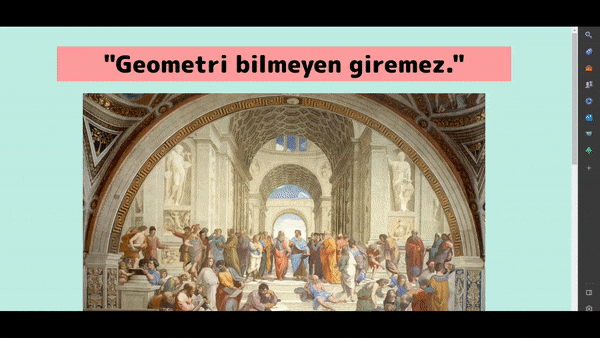
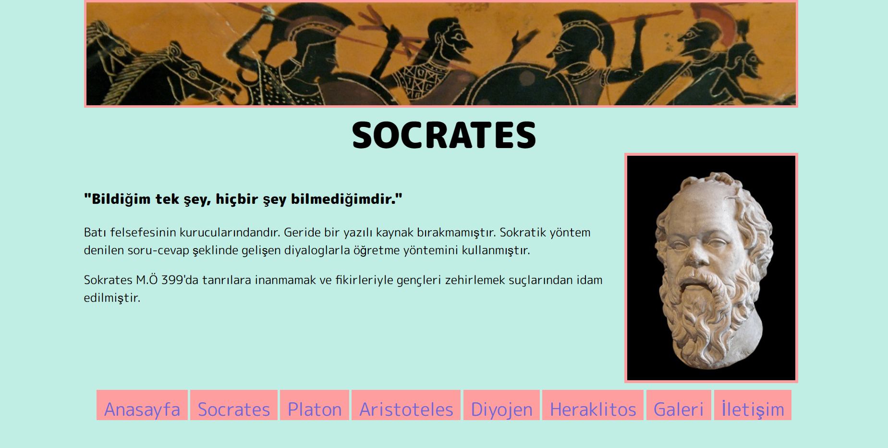
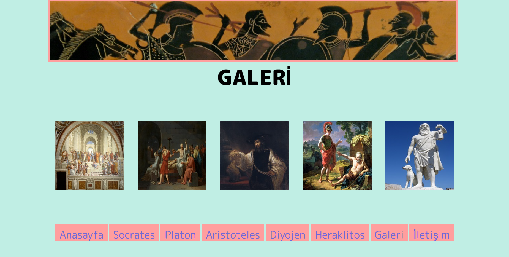

This was my first project related to my Front-End training. It's a static website, I just used Html and CSS. In creating the site, I was inspired by Raphael's School of Athens fresco and tried to combine my two passions (software and philosophy).

